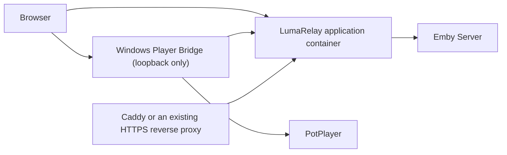

# LumaRelay

**English** | [简体中文](README.zh-CN.md)

LumaRelay is a modern, self-hosted media interface for Emby. A protected Gateway
talks to Emby while a Windows Player Bridge safely hands playback to a local
PotPlayer instance. LumaRelay does not include an HTML5 video player, and the
browser and player command line never receive the Emby access token.

> `v0.2.0-rc.1` is a release candidate. The installer and final 15-second
> progress-accuracy gate are still in progress, so do not treat the RC as a
> stable release.

## Features

- Responsive React library, search, details, user state, and adaptive themes.
- Fastify Gateway with SQLite, CSRF protection, rate limits, and log redaction.
- One-time play tickets that keep Emby access tokens out of the browser.
- Windows Player Bridge pairing, PotPlayer launch, SMTC monitoring, and playback
  progress reporting.
- One application image serving both the Web UI and `/api/v1`; no separate Web
  and Gateway containers.

## Architecture



Caddy is only an optional HTTPS entry point. If you already operate a reverse
proxy, the LumaRelay application is the only container you need.

## Docker quick start

1. Copy the configuration and replace the development values with your HTTPS
   origins and independently generated secrets:

   ```shell
   cp .env.example .env
   node -e "console.log(require('crypto').randomBytes(48).toString('base64url'))"
   node -e "console.log(require('crypto').randomBytes(32).toString('base64'))"
   ```

2. Start LumaRelay with the optional Caddy HTTPS profile:

   ```shell
   docker compose pull
   docker compose --profile https up -d
   ```

With an existing reverse proxy, use `docker compose up -d app` or run only the
application image:

```shell
docker run -d \
  --name lumarelay \
  --env-file .env \
  -e NODE_ENV=production \
  -e LUMARELAY_COOKIE_SECURE=true \
  -e LUMARELAY_DATABASE_PATH=/data/lumarelay.db \
  -p 127.0.0.1:3000:3000 \
  -v lumarelay_data:/data \
  ghcr.io/hqyel/lumarelay:edge
```

Proxy HTTPS traffic to `http://127.0.0.1:3000`. Production mode rejects HTTP
public origins, HTTP Emby origins, development secrets, and insecure cookies.

Key configuration:

| Variable                                | Purpose                                             |
| --------------------------------------- | --------------------------------------------------- |
| `LUMARELAY_DOMAIN`                      | Public domain used by the included Caddy service    |
| `LUMARELAY_PUBLIC_ORIGIN`               | Exact HTTPS Web origin                              |
| `LUMARELAY_EMBY_BASE_URL`               | Active Emby Server URL                              |
| `LUMARELAY_EMBY_ALLOWED_SERVER_ORIGINS` | Exact Emby origins the Gateway may contact          |
| `LUMARELAY_BRIDGE_ALLOWED_ORIGINS`      | Exact Web origins accepted by Player Bridge         |
| `LUMARELAY_SESSION_SECRET`              | Independent random secret of at least 32 characters |
| `LUMARELAY_TOKEN_ENCRYPTION_KEY`        | Canonical Base64 value containing 32 random bytes   |
| `LUMARELAY_COOKIE_SECURE`               | Must be `true` in production                        |
| `LUMARELAY_DATABASE_PATH`               | SQLite path; `/data/lumarelay.db` in the container  |
| `LUMARELAY_HOST` / `LUMARELAY_PORT`     | Application listener; defaults to `127.0.0.1:3000`  |
| `LUMARELAY_TRUST_PROXY`                 | Trusted proxy hop count or exact IP/CIDR list       |
| `LUMARELAY_LOG_LEVEL`                   | Gateway log level; defaults to `info`               |
| `LUMARELAY_IMAGE_TAG`                   | Compose image tag; defaults to `edge`               |

## Windows Player Bridge

Download `LumaRelay.PlayerBridge-<version>-win-x64.zip` from a GitHub Release,
extract it to a stable directory, and register the protocol:

```powershell
.\LumaRelay.PlayerBridge.exe --register-protocol
```

Generate a 60-second pairing code from the Bridge page in LumaRelay and complete
the pairing locally. Before moving or deleting the executable, run `--shutdown`
and `--unregister-protocol`. The current RC is portable and does not yet include
an installer or automatic updater. Its loopback service remains on port `58080`;
set `LUMARELAY_BRIDGE_PORT` only if that port is unavailable.

## Development

Development requires Node.js 22.13.x, pnpm 11.13.1, and .NET SDK 8.0.422. The
Player Bridge requires Windows 10 version 2004 (build 19041) or newer and
PotPlayer 1.7.22398.0 or newer.

```shell
pnpm install --frozen-lockfile
pnpm dev
pnpm verify:local
pnpm bridge:publish
```

Real-server smoke tests read temporary `LUMARELAY_EMBY_SMOKE_BASE_URL`,
`LUMARELAY_EMBY_SMOKE_USERNAME`, and `LUMARELAY_EMBY_SMOKE_PASSWORD` values from
the current process. Never store them in `.env` or commit them.

## Images and releases

- `edge`: latest successful build from `main`.
- `sha-<commit>`: immutable commit image.
- `0.2.0-rc.1`: release-candidate image and GitHub prerelease.
- `latest`, `X.Y`, and `X`: stable releases only.

Published images include an SBOM and build provenance. Tagged releases also
include the Windows Player Bridge archive and `SHA256SUMS`.

## Security and license

Read [SECURITY.md](SECURITY.md) before exposing LumaRelay to a network. Never
commit `.env`, databases, logs, Emby tokens, server credentials, or generated
secrets.

LumaRelay is an independent open-source project and is not affiliated with or
endorsed by Emby or the owners of PotPlayer. Product names and trademarks belong
to their respective owners.

Licensed under the [MIT License](LICENSE).
