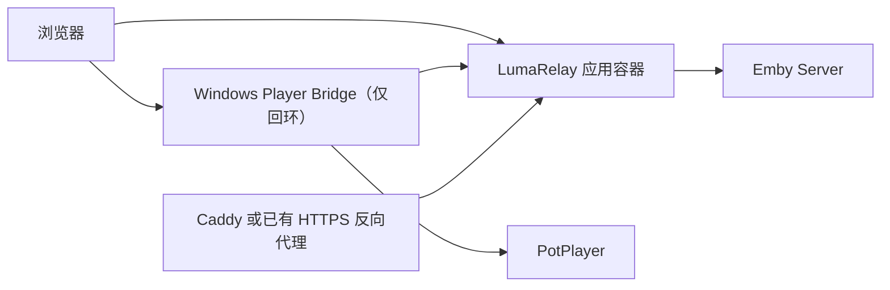

# LumaRelay

[English](README.md) | **简体中文**

LumaRelay 是一个面向 Emby 的现代自托管媒体界面。它通过受保护的 Gateway 访问 Emby，并将播放安全地交给 Windows 上的本地 PotPlayer。项目本身不包含 HTML5 视频播放器，也不会把 Emby
AccessToken 暴露给浏览器或播放器命令行。

> 当前版本为 `v0.2.0-rc.1`
> 候选版。安装器与最终 15 秒进度误差验收仍在完成中，不建议把 RC 当作稳定版使用。

## 功能

- React 媒体库、搜索、详情页、用户状态和响应式深浅主题。
- Fastify Gateway、SQLite 持久化、CSRF 防护、请求限流和敏感日志脱敏。
- 一次性播放票据，浏览器永远不会获得 Emby AccessToken。
- Windows Player Bridge 配对、PotPlayer 启动、SMTC 状态监控和播放进度回传。
- 一个应用镜像同时提供 Web 和 `/api/v1`，无需分别部署 Web 与 Gateway。

## 架构



Caddy 只是可选的 HTTPS 入口。如果已有反向代理，部署时只需运行 LumaRelay 应用容器。

## Docker 快速开始

1. 复制配置并填写自己的 HTTPS 地址和独立随机密钥：

   ```shell
   cp .env.example .env
   node -e "console.log(require('crypto').randomBytes(48).toString('base64url'))"
   node -e "console.log(require('crypto').randomBytes(32).toString('base64'))"
   ```

2. 使用可选的 Caddy HTTPS profile 启动：

   ```shell
   docker compose pull
   docker compose --profile https up -d
   ```

如果已有反向代理，可运行 `docker compose up -d app`，或只运行应用镜像：

```shell
docker run -d \
  --name lumarelay \
  --env-file .env \
  -e NODE_ENV=production \
  -e LUMARELAY_COOKIE_SECURE=true \
  -e LUMARELAY_DATABASE_PATH=/data/lumarelay.db \
  -p 127.0.0.1:3000:3000 \
  -v lumarelay_data:/data \
  ghcr.io/hqyel/lumarelay:edge
```

将反向代理指向 `http://127.0.0.1:3000`。生产环境必须使用 HTTPS。

主要配置：

| 变量                                    | 说明                                       |
| --------------------------------------- | ------------------------------------------ |
| `LUMARELAY_DOMAIN`                      | 内置 Caddy 使用的公开域名                  |
| `LUMARELAY_PUBLIC_ORIGIN`               | 精确的 HTTPS Web Origin                    |
| `LUMARELAY_EMBY_BASE_URL`               | 当前 Emby Server 地址                      |
| `LUMARELAY_EMBY_ALLOWED_SERVER_ORIGINS` | 允许访问的 Emby Origin 列表                |
| `LUMARELAY_BRIDGE_ALLOWED_ORIGINS`      | Bridge 接受的精确 Web Origin 列表          |
| `LUMARELAY_SESSION_SECRET`              | 至少 32 字符的独立随机密钥                 |
| `LUMARELAY_TOKEN_ENCRYPTION_KEY`        | 32 字节标准 Base64 密钥                    |
| `LUMARELAY_COOKIE_SECURE`               | 生产环境必须为 `true`                      |
| `LUMARELAY_DATABASE_PATH`               | SQLite 路径，容器默认 `/data/lumarelay.db` |
| `LUMARELAY_HOST` / `LUMARELAY_PORT`     | 应用监听地址，默认 `127.0.0.1:3000`        |
| `LUMARELAY_TRUST_PROXY`                 | 可信代理跳数或精确 IP/CIDR 列表            |
| `LUMARELAY_LOG_LEVEL`                   | Gateway 日志等级，默认为 `info`            |
| `LUMARELAY_IMAGE_TAG`                   | Compose 镜像标签，默认 `edge`              |

## Windows Player Bridge

从 GitHub Release 下载
`LumaRelay.PlayerBridge-<version>-win-x64.zip`，解压到稳定目录并运行：

```powershell
.\LumaRelay.PlayerBridge.exe --register-protocol
```

然后在 LumaRelay 的 Bridge 页面生成 60 秒配对码并完成配对。移动或删除程序之前，请先运行
`--shutdown` 和
`--unregister-protocol`。当前 RC 是便携版本，尚未提供安装器和自动更新。Bridge 的回环服务端口保持为
`58080`；仅在端口冲突时设置 `LUMARELAY_BRIDGE_PORT`。

## 本地开发

要求 Node.js 22.13.x、pnpm 11.13.1 和 .NET SDK 8.0.422。Windows
Bridge 运行要求 Windows 10 2004（build 19041）或更高版本，以及 PotPlayer
1.7.22398.0 或更高版本。

```shell
pnpm install --frozen-lockfile
pnpm dev
pnpm verify:local
pnpm bridge:publish
```

真实 Emby 冒烟测试只从当前进程读取临时的
`LUMARELAY_EMBY_SMOKE_BASE_URL`、`LUMARELAY_EMBY_SMOKE_USERNAME` 和
`LUMARELAY_EMBY_SMOKE_PASSWORD`。不要把它们写入 `.env` 或提交到仓库。

## 镜像与 Release

- `edge`：`main` 的最新成功构建。
- `sha-<commit>`：不可变提交镜像。
- `0.2.0-rc.1`：候选版本镜像和 GitHub prerelease。
- `latest`、`X.Y`、`X`：仅稳定版本标签。

所有发布镜像包含 SBOM 和构建 provenance。Release 同时提供 Windows
Bridge 压缩包和 `SHA256SUMS`。

## 安全与许可

请阅读 [SECURITY.md](SECURITY.md)。不要提交 `.env`、数据库、日志、Emby
Token、服务器凭据或生成密钥。

LumaRelay 是独立的开源项目，与 Emby 或 PotPlayer 的所有者没有隶属或认可关系。产品名称和商标归各自所有者所有。

本项目使用 [MIT License](LICENSE)。
